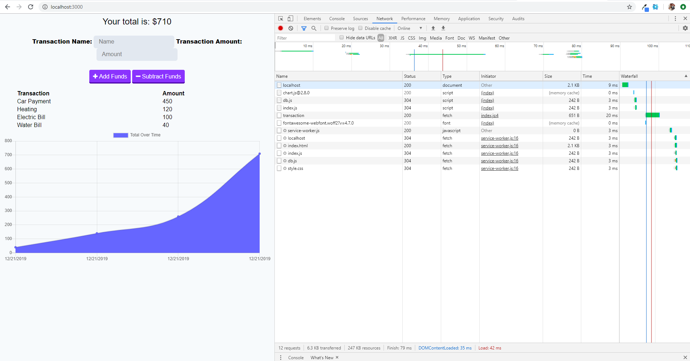
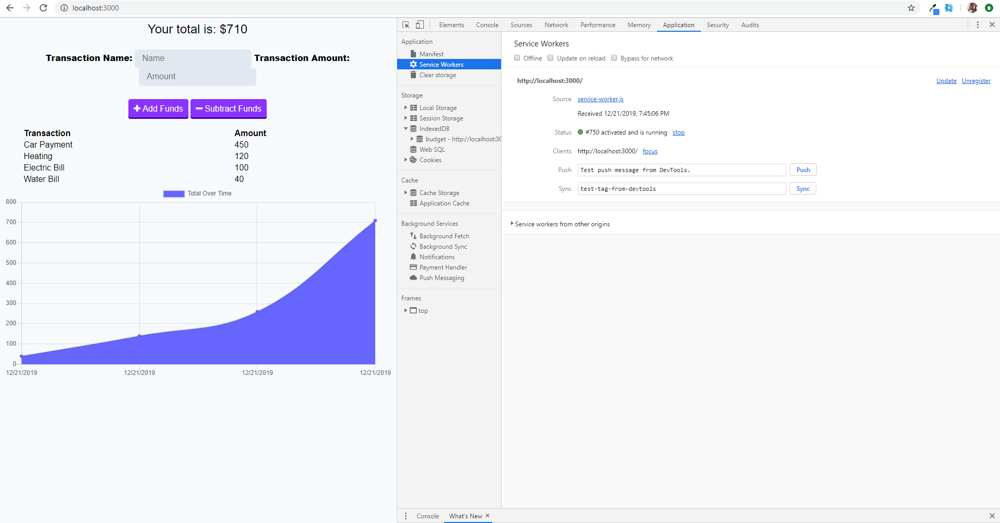
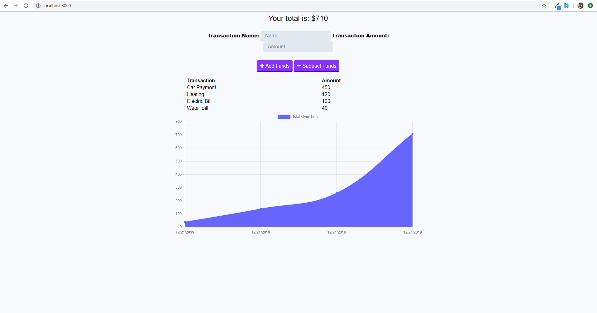

# Budget

## User Story
    As a user, I want the ability to keep track of my budget offline so that I can work while on flights.

## Visuals

  

	
### Photo Descriptions

    The user is asked to fill out the trasaction name and trasaction amount. Once filled out they can Add the funds or Subtract the funds.

    When they add the funds it updates the chart below and adds them to the list of transactions.

    The app is can also function offline.
    
## Usage
    Users looking for an app that will track their finances both online and offline.
   
## Links 

[Budget App](https://github.com/bsjherbert/Budget)